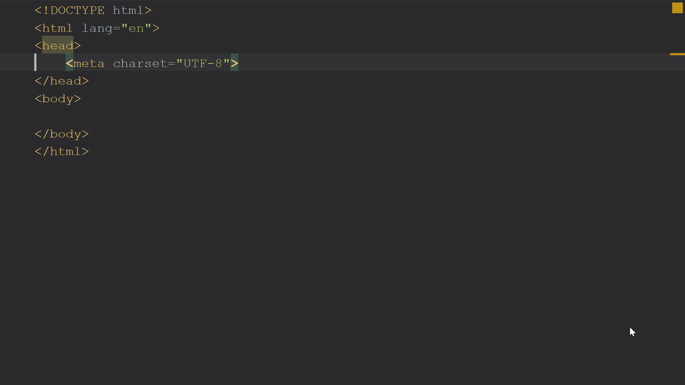
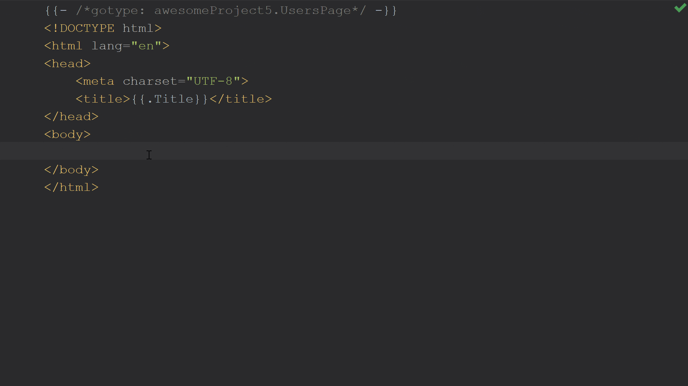
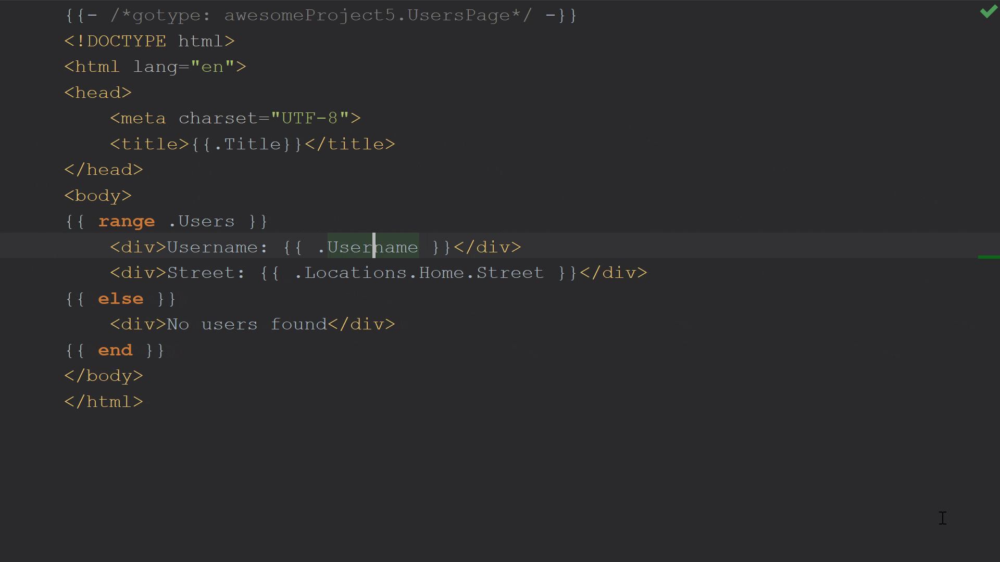

# Go Template Engine

## Table of Contents

<!-- START doctoc generated TOC please keep comment here to allow auto update -->
<!-- DON'T EDIT THIS SECTION, INSTEAD RE-RUN doctoc TO UPDATE -->

- [Hello World](#hello-world)
- [File Extensions](#file-extensions)
- [JetBrains Code Assistance](#jetbrains-code-assistance)
- [Contextual Encoding](#contextual-encoding)
- [Template Actions](#template-actions)
- [Using Functions Inside Templates](#using-functions-inside-templates)
- [Creating the V in MVC](#creating-the-v-in-mvc)
- [References](#references)

<!-- END doctoc generated TOC please keep comment here to allow auto update -->

## Hello World

- Go ships with its own template engine, split into two packages,
  `text/template` and `html/template`.
- These packages are similar in functionality,
  with the difference that `html/template` allows
  a user to generate HTML code that is safe against code injection,
  making it suitable for use on web pages and emails.

There two packages in go to work with templates:

- `text/templates` (Used for generating textual output)
- `html/templates` (Used for generating HTML output safe against code injection)

<br />

**`hello.go`**

<!-- AUTO-GENERATED-CONTENT:START (CODE:src=./hello.go) -->
<!-- The below code snippet is automatically added from ./hello.go -->

```go
package main

import (
	"html/template"
	"io/ioutil"
	"os"
)

// Templates (or Encoding Packages like JSON, YAML, Viper,...)
// cannot access "unexported" data members,
// so we have to export them somehow.

type (
	// Location struct
	Location struct {
		Street  string
		ZipCode string
	}

	// User struct
	User struct {
		Username  string
		Locations map[string]Location
	}

	// Page struct
	Page struct {
		Title string
		Users []User
	}
)

func main() {
	message, err := ioutil.ReadFile("hello.gohtml")
	if err != nil {
		panic(err)
	}

	// The three most important and most frequently used functions are:

	// 1. New — allocates new, undefined template,
	// New allocates a new, undefined template with the given name.

	// The name of the template–unsurprisingly–is to name the template.

	// What is it good for?
	// As long as you don't want to refer to the template,
	// it doesn't really matter.
	// But if you want to refer to it,
	// then yes, you refer to it by its name.

	// When would you want to refer to it?
	// When you want to include a template in another
	// e.g. using the {{template}} action,
	// or when you want to execute a specific template
	// using Template.ExecuteTemplate().

	// error checks omitted for brevity
	// Executes default, "one":
	// t.Execute(os.Stdout, nil)

	// Executes explicit, "one":
	// t.ExecuteTemplate(os.Stdout, "one", nil)

	// Executes explicit, "other":
	// t.ExecuteTemplate(os.Stdout, "other", nil)

	// 2. Parse — parses given template string and return parsed template,
	// Parse parses text as a template body for t (t *Template).

	// 3. Execute — applies parsed template to the data structure and writes result to the given writer.
	// Execute applies a parsed template to the specified data object, and writes the output to wr.

	tpl, err := template.New("hello").Parse(string(message))
	if err != nil {
		panic(err)
	}

	page := Page{
		Title: "Users Location",
		Users: []User{
			{
				Username: "Harrison Van",
				Locations: map[string]Location{
					"Home": {
						Street:  "ShopBack",
						ZipCode: "2020",
					},
				},
			},
			{
				Username: "Hieu Van",
				Locations: map[string]Location{
					"Home": {
						Street:  "GitHub",
						ZipCode: "2020",
					},
				},
			},
		},
	}

	err = tpl.Execute(os.Stdout, page)
	if err != nil {
		panic(err)
	}
}
```

<!-- AUTO-GENERATED-CONTENT:END -->

<br />

**`hello.gohtml`**

<!-- AUTO-GENERATED-CONTENT:START (CODE:src=./hello.gohtml) -->
<!-- The below code snippet is automatically added from ./hello.gohtml -->

```gohtml
{{- /*gotype: templating.Page*/ -}}
<!DOCTYPE html>
<html lang="en">
<head>
    <meta charset="UTF-8">
    <title>{{.Title}}</title>
</head>
<body>
{{range .Users}}
    <div>Username: {{.Username}} </div>
    <div>Location: {{.Locations.Home.Street}}</div>
{{else}}
    <div>No users found</div>
{{end}}
</body>
</html>
```

<!-- AUTO-GENERATED-CONTENT:END -->

<br />

```shell script
go run hello.go
```

<!-- AUTO-GENERATED-CONTENT:START (CODE:src=./output/hello.html) -->
<!-- The below code snippet is automatically added from ./output/hello.html -->

```html
<!DOCTYPE html>
<html lang="en">
  <head>
    <meta charset="UTF-8" />
    <title>Users Location</title>
  </head>
  <body>
    <div>Username: Harrison Van</div>
    <div>Location: ShopBack</div>

    <div>Username: Hieu Van</div>
    <div>Location: GitHub</div>
  </body>
</html>
```

<!-- AUTO-GENERATED-CONTENT:END -->

## File Extensions

```text
Supported by JetBrains plugin Go Template by default
├── example.gohtml
├── example.goyaml (not supported by default but a similar example)

Used by Helm Template
Used by PHP Smarty Template Engine (Supported by Smarty plugin in IntelliJ and PhpStorm)
Most prefer personally
├── example.tpl
├── example.html.tpl

Most used, even mentioned in
https://golang.org/pkg/html/template/
├── example.tmpl
├── example.html.tmpl
```

## JetBrains Code Assistance

To use code assistance in Go templates:

- Ensure that your project folder is under `GOPATH`.
  To check your `GOPATH`, open settings `⌘`, and navigate to `Go | GOPATH`.

- However, `GOPATH` will be deprecated soon.
  As of `1.11`, Go supports a much better way to manage your project using `Go Modules`.
  It enables the use of modules when the current directory
  or any parent directory has a `go.mod`, provided the directory is outside `GOPATH`.

  ```shell script
  $ go mod init templating
  go: creating new go.mod: module templating
  ```

Define mapping of a type between Go template and application

To specify mapping of a type between a Go template and an application,
GoLand uses the `gotype` comment of the following structure:
`{{- /*gotype: package/import/path.type_name*/ -}}`.

1. Type `{{.}}`.
1. Place the caret inside `{{.}}`, press `⌥⏎`, and select `Specify dot type`.
1. In the `gotype` comment section,
   select the necessary type from the code completion popup `⌃Space`.

Alternatively, type `{{- /*gotype: */ -}}`,
place the caret after `gotype:`, press `⌃Space`, and select the necessary type.

Inside `{{.}}`, press `Ctrl+Space` and select Title
You can use tpl_example.gohtml as a reference

<div align="center"></div>

This doesn't work only for structure fields as the `Title` of the page works,
but it works for slices, slice elements, and even for elements that are
part of a map and are a more complex type.

<div align="center"></div>

Besides completion options,
once you specify the type of the dot in the template,
other functionality such as `Navigate to Declaration`, `Find Usages`,
or even `Rename` refactoring will work as the IDE has enough information to
complete these actions.

<div align="center"></div>

## Contextual Encoding

## Template Actions

## Using Functions Inside Templates

## Creating the V in MVC

## References

- [Go Templates Made Easy](https://blog.jetbrains.com/go/2018/12/14/go-templates-made-easy/)
- [Integration with Go Templates](https://www.jetbrains.com/help/go/integration-with-go-templates.html)
- [ ] [An Introduction to Templates in Go](https://www.calhoun.io/intro-to-templates/)
- [ ] [Go Template Examples and Code Generator](https://github.com/phcollignon/Go-Template)
- [ ] [Golang Templates Cheatsheet](https://curtisvermeeren.github.io/2017/09/14/Golang-Templates-Cheatsheet)
- [ ] [Introduction to Hugo Templating](https://gohugo.io/templates/introduction/)
- [ ] [Template Debugging](https://gohugo.io/templates/template-debugging/)
